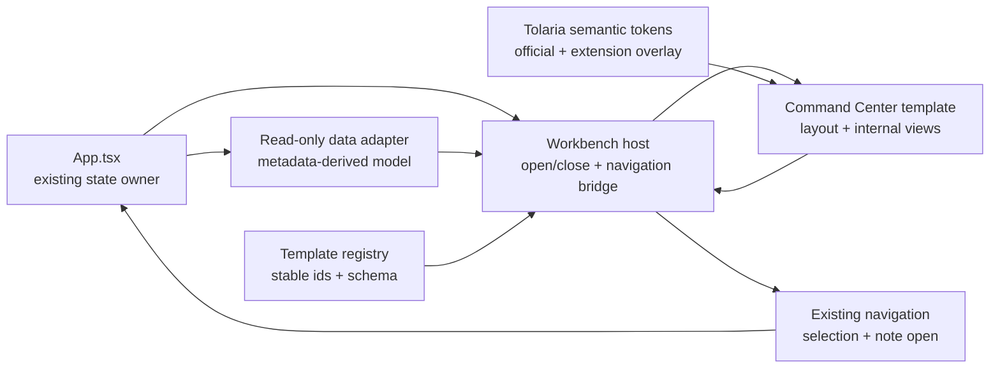

# Workbench templates

Status: phase-one core, renderer dispatch, live data wiring, and the baseline-aligned
Focus, Knowledge, and Projects views are implemented.

This document defines the downstream Tolaria workbench extension planned on branch
`feature/workbench-template-v2026-09-02`. It is the implementation guide and upstream
merge reference for the first workbench release.

## Product decision

The workbench is an application-level reading and navigation surface derived from the
vault data Tolaria has already loaded. It does not replace Tolaria's sidebar, note list,
editor, filesystem model, or color-theme runtime.

The first release contains one **workbench style template**:

- Stable id: `command-center`
- Display name: Intelligent Command Center / 智能指挥中心
- Template schema: `1`
- Internal views: `focus`, `knowledge`, and `projects`

The three internal views are not separate templates. They are different information
views owned by the Intelligent Command Center template:

| View id | Display purpose |
|---|---|
| `focus` | Today's recent activity, actionable notes, and quick destinations |
| `knowledge` | Knowledge clusters, Types, folders, and relationship activity |
| `projects` | Status-oriented lanes and active work summaries |

Future templates may serve different professions or working styles without changing
the workbench host. Examples include researcher, software-engineering, project-management,
and minimalist knowledge-garden templates.

## Accepted visual baseline

The formal Command Center v1 layout and interaction reference is recorded in
[`WORKBENCH-VISUAL-BASELINE.md`](WORKBENCH-VISUAL-BASELINE.md), with the accepted
standalone page stored at
[`workbench/command-center-v1-visual-baseline.html`](workbench/command-center-v1-visual-baseline.html).

Implementation must preserve its greeting and daily-context layer, prominent full-width
three-view navigation, Focus-view information hierarchy, and semantic-theme inheritance.
Responsive reflow is expected, but material visual or hierarchy changes require a new
versioned baseline and explicit acceptance rather than silently changing this reference.

The Knowledge-view composition is accepted in
[`WORKBENCH-KNOWLEDGE-VISUAL-BASELINE.md`](WORKBENCH-KNOWLEDGE-VISUAL-BASELINE.md).
Its Type-centered constellation, relationship overview, knowledge stream, and portal
hierarchy are authoritative for the first Knowledge implementation.

## Goals

1. Add a global **Workbench** entry immediately before **Contribute** in Tolaria's
   bottom-right status-bar group.
2. Keep the official sidebar and status bar mounted while the workbench replaces only
   the note-list and editor region.
3. Add **Workbench style** under **Settings → Appearance** using the existing settings
   row and shadcn select patterns.
4. Register the Intelligent Command Center as the only phase-one template through a
   stable template registry rather than hard-coding it in `App.tsx`.
5. Derive all displayed information from existing `VaultEntry[]`, `ViewFile[]`, and
   `FolderNode[]` state without another vault scan.
6. Navigate through the existing selection and note-opening callbacks so the workbench
   does not create a second navigation model.
7. Inherit every color from Tolaria's semantic theme tokens. Workbench templates own
   layout and presentation, never a separate palette.
8. Leave a versioned path for constrained component rearrangement in a later phase.

## Non-goals for phase one

- No free-form or constrained drag-and-drop editor.
- No user-authored template files or template marketplace.
- No arbitrary HTML, CSS, JavaScript, or React code loaded from a template package.
- No workbench configuration written into notes or vault frontmatter.
- No Rust command, database, cache, or second filesystem scan.
- No duplicated Sidebar, NoteList, or Editor implementation.
- No workbench-specific color selector.
- No automatic AI/model request. The first summary is deterministic and local, based
  only on already-loaded metadata.
- No persistence of whether the workbench is currently open.

## Existing architecture assessment

### Root composition

`src/App.tsx` is the renderer state orchestrator. `MainApp` already owns:

- the current `SidebarSelection`;
- `visibleEntries` from the mounted workspace graph;
- `vault.folders` and `vault.views`;
- `notes.handleSelectNote` for the canonical note-opening path;
- `handleSetSelection` for the canonical collection-navigation path;
- the settings and status-bar callbacks.

The normal shell is:

```text
AppPreferencesProvider
└── app-shell
    ├── app
    │   ├── Sidebar
    │   ├── NoteList or PulseView
    │   └── LazyEditor
    ├── banners
    ├── StatusBar
    └── dialogs and transient surfaces
```

The workbench should not become another application route or native window. It needs
the already-loaded graph and should keep the current sidebar context visible. The
smallest host change is therefore:

```text
app
├── Sidebar (unchanged)
└── if workbench is open
    └── WorkbenchSurface
   else
    ├── NoteList or PulseView
    └── LazyEditor
```

The bottom StatusBar remains mounted in both states. Closing the workbench changes only
transient renderer state, so the current selection, open tabs, editor content, panel
widths, and navigation history remain owned by their official code paths.

### Status-bar entry point

`src/components/StatusBar.tsx` forwards bottom-bar callbacks into
`StatusBarSecondarySection` in `src/components/status-bar/StatusBarSections.tsx`.
The secondary section currently renders, in order:

1. optional zoom reset;
2. Contribute;
3. Docs;
4. light/dark toggle;
5. Settings.

The Workbench button belongs immediately before Contribute. It should reuse the existing
`StatusLinkButton` pattern, `Button` primitive, tooltip, compact icon-only behavior, and
status-bar responsive rules. This makes it a global application surface rather than a
vault hierarchy item.

### Settings entry point

`SettingsPanel.tsx` renders `AppearanceSettingsSection`, which already delegates the
downstream color and editor-font controls to feature-owned components. The planned
`WorkbenchStyleSettings` follows the same boundary:

```tsx
<SettingsRow label={t('settings.workbenchStyle.label')} ...>
  <WorkbenchStyleSettings />
</SettingsRow>
```

The setting control uses the existing `SelectControl`; it must not add a raw `<select>`.
Phase one exposes one selected option so the contract and user expectation are stable
before additional templates arrive.

### Data and navigation reuse

The frontend already contains the required canonical models and filtering behavior:

- `VaultEntry` contains title, Type, status, timestamps, relationships, outgoing links,
  favorite/archived state, workspace identity, and generic properties.
- `ViewFile` contains the saved-view definition and workspace provenance.
- `FolderNode` contains the recursive folder tree and workspace provenance.
- `filterEntries()` in `src/utils/noteListHelpers.ts` resolves sidebar selections using
  the same folder, Type, view, and built-in-filter behavior as NoteList.
- `collectionFromSelection()` and `resolveCollectionEntries()` provide a reusable
  collection boundary for Type, folder, saved-view, and built-in selections.

The workbench data adapter may compose these functions but must not copy their filtering
rules. Card navigation has two forms:

- Collection destination: close workbench, then call the existing selection callback
  with a `SidebarSelection`.
- Note destination: close workbench, then call the existing note-opening callback with
  the current `VaultEntry`.

### Theme inheritance

Tolaria's official Light, Dark, and System runtime resolves semantic variables in
`src/index.css`. The downstream theme extension overlays those same variables. Workbench
CSS must consume tokens such as:

- `--surface-app`, `--surface-sidebar`, `--surface-card`;
- `--text-primary`, `--text-secondary`, `--text-heading`;
- `--border-default`, `--border-subtle`, `--border-strong`;
- `--accent-blue`, `--accent-blue-hover`, `--accent-blue-light`;
- the shadcn aliases `--background`, `--foreground`, `--card`, `--muted`, `--border`,
  and `--primary`.

The workbench must not identify Rosé Pine, Nord, Blue Topaz, or Catppuccin by id. A
template renders correctly solely because the active official or extension theme has
already populated the semantic token contract.

## Architecture



### Layer responsibilities

| Layer | Owns | Must not own |
|---|---|---|
| Host | open/close state, selected template/view, error boundary, navigation bridge | vault scanning, filtering rules, palette colors |
| Registry | template ids, labels, capabilities, schema version, default layout metadata | React application state, persistence side effects |
| Data adapter | deterministic projections from loaded models | note writes, new IPC commands, note-body loading |
| Template | composition, responsive layout, internal view selection | Tolaria settings schema, direct localStorage calls, navigation internals |
| Widget | one bounded presentation and interaction | template registration, global application state |
| Preferences | validation, defaults, versioned local persistence, change notifications | workbench rendering or vault data |

## Public feature contracts

The exact TypeScript syntax may be refined during TDD, but implementation should retain
the following boundaries.

### Template definition

```typescript
type WorkbenchTemplateId = string
type WorkbenchViewId = string

interface WorkbenchTemplateDefinition {
  id: WorkbenchTemplateId
  schemaVersion: 1
  labelKey: TranslationKey
  defaultViewId: WorkbenchViewId
  views: readonly WorkbenchTemplateView[]
  defaultLayout: readonly WorkbenchWidgetPlacement[]
}
```

The shared types intentionally accept opaque string ids so registering a second template
does not require editing the registry core. Registry validation supplies the runtime
safety: it rejects duplicate ids, missing default views, undeclared widgets, invalid
placements, and unsupported schemas. Rendering remains a host/template concern rather
than part of the pure metadata registry. `App.tsx` must not import
`CommandCenterTemplate` directly; it imports only the feature facade.

### Template view

```typescript
interface WorkbenchTemplateView {
  id: WorkbenchViewId
  labelKey: TranslationKey
  widgetIds: readonly WorkbenchWidgetId[]
}
```

### Widget identity and default placement

```typescript
type WorkbenchWidgetId =
  | 'daily-brief'
  | 'daily-pulse'
  | 'action-queue'
  | 'quick-portals'
  | 'knowledge-map'
  | 'knowledge-stream'
  | 'project-lanes'

interface WorkbenchWidgetPlacement {
  widgetId: WorkbenchWidgetId
  viewId: WorkbenchViewId
  column: number
  row: number
  columnSpan: number
  rowSpan: number
  minColumnSpan?: number
  maxColumnSpan?: number
}
```

Phase one uses `defaultLayout` as immutable template metadata. Defining placement now
provides a migration-safe base for later constrained customization without shipping a
drag dependency or editable layout state.

### Data snapshot

```typescript
interface WorkbenchSourceData {
  entries: readonly VaultEntry[]
  folders: readonly FolderNode[]
  views: readonly ViewFile[]
  activeSelection: SidebarSelection
  loading: boolean
}

interface WorkbenchModel {
  summary: WorkbenchSummary
  recentEntries: readonly VaultEntry[]
  actionableEntries: readonly VaultEntry[]
  favoriteEntries: readonly VaultEntry[]
  savedViewSummaries: readonly WorkbenchDestinationSummary[]
  typeSummaries: readonly WorkbenchDestinationSummary[]
  folderSummaries: readonly WorkbenchDestinationSummary[]
  relationshipSummary: WorkbenchRelationshipSummary
  knowledgeClusters: readonly WorkbenchKnowledgeCluster[]
}
```

The adapter is a pure function and returns stable, bounded lists. It should use memoized
call sites so ordinary editor keystrokes do not rebuild the workbench model.

### Navigation contract

```typescript
interface WorkbenchNavigation {
  openSelection(selection: SidebarSelection): void
  openEntry(entry: VaultEntry): void
  close(): void
}
```

Templates receive these actions from the host. They never import `App.tsx`, mutate tabs,
or construct filesystem paths.

## Phase-one information rules

The static prototype contains illustrative content. Production phase one must derive
labels and counts from real data and must not hard-code a user's Type, folder, saved-view,
or project names.

Recommended deterministic rules:

| Surface | Rule |
|---|---|
| Recent entries | newest non-archived Markdown entries by `modifiedAt`, bounded to a small list |
| Favorites | non-archived entries with `favorite === true` |
| Action queue | non-archived entries with a meaningful `status`; do not hard-code a completed-status vocabulary |
| Quick portals | saved views first, then visible Types and top-level folders, all with real selection destinations |
| Knowledge map | bounded Type/relationship aggregates from `isA`, `relationships`, and `outgoingLinks` |
| Knowledge stream | recently modified entries that have relationships or outgoing links |
| Project lanes | status groups derived from actual values; do not assume a fixed status vocabulary |
| Today summary | local sentence assembled from counts and timestamps; no model/API call |

All lists must handle an empty or partially loaded vault. Empty states explain which
existing Tolaria concept supplies the data, rather than prompting the user to create a
workbench-specific database.

## Preference storage

### Phase one

Template choice and last internal view are installation-local presentation preferences.
To minimize upstream coupling, phase one stores them under one namespaced renderer key:

```text
tolaria.workbench.preferences.v1
```

```json
{
  "schemaVersion": 1,
  "templateId": "command-center",
  "activeViewId": "focus"
}
```

Rules:

- Invalid JSON, unknown versions, template ids, or view ids fall back to registry defaults.
- Write only validated values.
- Dispatch a namespaced change event and also listen for the browser `storage` event so
  secondary renderer windows remain consistent where relevant.
- Workbench open/closed state is session-only and defaults to closed at application start.
- Do not store the active color theme; the semantic theme runtime remains authoritative.
- Do not add phase-one fields to Rust `Settings`, `VaultConfig`, or note frontmatter.

### Future user layout

If phase-two usage justifies customization, persist a separate versioned override instead
of mutating template defaults:

```typescript
interface WorkbenchUserLayoutV1 {
  schemaVersion: 1
  templateId: string
  hiddenWidgetIds: string[]
  placements: WorkbenchWidgetPlacement[]
}
```

The editor should support only template-constrained reorder, hide/show, and bounded
resizing. It must provide **Restore template defaults**. Arbitrary pixel coordinates,
overlapping widgets, custom code, and unconstrained canvas placement remain out of scope.

The phase-two storage scope must be decided from user research before implementation:
installation-wide layout is simpler, while a per-vault layout may better match different
knowledge bases. Phase one deliberately does not lock in that scope.

## First-phase file structure

```text
src/features/workbench/
├── index.ts
├── builtInWorkbenchRenderers.ts
├── builtInWorkbenchTemplates.ts
├── core/
│   ├── workbenchTypes.ts
│   ├── workbenchRegistry.ts
│   ├── workbenchRegistry.test.ts
│   ├── workbenchPreferences.ts
│   ├── workbenchPreferences.test.ts
│   ├── workbenchController.ts
│   ├── workbenchController.test.ts
│   ├── buildWorkbenchModel.ts
│   └── buildWorkbenchModel.test.ts
├── host/
│   ├── WorkbenchRenderer.tsx
│   ├── WorkbenchRenderer.test.tsx
│   ├── WorkbenchSurface.tsx
│   ├── WorkbenchSurface.test.tsx
│   ├── useWorkbenchController.ts
│   ├── useWorkbenchNavigation.ts
│   └── workbenchRendererTypes.ts
├── navigation/
│   ├── workbenchNavigation.ts
│   ├── workbenchNavigation.test.ts
│   ├── workbenchDestinations.ts
│   └── workbenchDestinations.test.ts
├── settings/
│   ├── WorkbenchStyleSettings.tsx
│   └── WorkbenchStyleSettings.test.tsx
├── templates/
│   └── command-center/
│       ├── commandCenterManifest.ts
│       ├── CommandCenterKnowledgeView.tsx
│       ├── CommandCenterProjectsView.tsx
│       ├── CommandCenterTemplate.tsx
│       ├── CommandCenterTemplate.test.tsx
│       └── widgets/
│           ├── ActionQueueWidget.tsx
│           ├── DailyBriefWidget.tsx
│           ├── DailyPulseWidget.tsx
│           ├── KnowledgeMapWidget.tsx
│           ├── KnowledgeStreamWidget.tsx
│           ├── ProjectLanesWidget.tsx
│           └── QuickPortalsWidget.tsx
└── testing/
    └── workbenchFixtures.ts
```

Files should be added incrementally. A component should not be split into its own file
until it has a bounded responsibility or independent tests; the tree above is the target
boundary, not a requirement to create empty scaffolding.

### Implemented core and host boundary

The first three TDD milestones keep the feature boundary independent from Tolaria's
application orchestrator:

- `core/workbenchTypes.ts` defines template metadata, the read-only source snapshot,
  destinations, summaries, and the derived model.
- `core/workbenchRegistry.ts` is a generic validated registry with no built-in template
  imports.
- `templates/command-center/commandCenterManifest.ts` owns the first immutable layout
  manifest; `builtInWorkbenchTemplates.ts` is the only composition point that registers
  built-in templates.
- `core/workbenchPreferences.ts` validates the versioned local preference, safely handles
  unavailable storage, emits a namespaced same-window event, and observes both that event
  and browser `storage` events.
- `core/buildWorkbenchModel.ts` creates bounded deterministic projections and delegates
  saved-view, Type, and folder counts to Tolaria's canonical `filterEntries()` behavior.
- `core/workbenchController.ts` owns the subscribable session snapshot. Open/closed state
  is transient, while validated template/view changes pass through the preference
  boundary. The API can later connect to React through `useSyncExternalStore` without
  making React part of the core.
- `navigation/workbenchNavigation.ts` is a close-first bridge to Tolaria's existing
  collection and note callbacks. It forwards the original objects unchanged and supports
  both synchronous and asynchronous host navigation.
- `host/useWorkbenchController.ts` is the only React subscription adapter. It consumes
  the controller as an injected external store and does not create or own it.
- `host/WorkbenchSurface.tsx` is a DOM-free conditional host. While closed it returns the
  injected official content; while open it calls the injected workbench renderer with
  the resolved snapshot. Layout, data composition, and visual styling remain outside
  this host.
- `host/WorkbenchRenderer.tsx` dispatches the selected template through an injected
  renderer map and provides a localized failure surface if metadata and renderer
  registration ever drift. `builtInWorkbenchRenderers.ts` is the only built-in React
  composition point, parallel to the metadata registry.
- `host/useWorkbenchNavigation.ts` keeps the React/App composition seam small while
  deferring all close-first navigation work to `createWorkbenchNavigation()`.
- `templates/command-center/CommandCenterTemplate.tsx` implements the accepted responsive
  Focus composition from the supplied read-only model: time-aware greeting, optional
  daily-context placeholders, local rotating thought, prominent three-view navigation,
  deterministic context brief and pulse counts, bounded recent notes, and bounded
  saved-view, Type, and folder portals. It imports neither application state nor theme ids.
- `templates/command-center/CommandCenterKnowledgeView.tsx` implements the accepted
  Knowledge composition as one feature-local view: a Type-centered constellation with
  selectable inspector, real relationship-health metrics, a bounded knowledge stream,
  and existing Type/folder/saved-view portals. It consumes only the injected model and
  navigation adapter; it adds no graph engine, scan, persistence, or application state.
- `templates/command-center/CommandCenterProjectsView.tsx` implements the accepted
  Projects composition as one feature-local view: a status-grouped Project Execution
  Board, real-count execution pulse, bounded next-step queue, and recent project signal
  stream. It consumes only existing model projections and note navigation; it does not
  infer progress, add editing, or introduce another state owner.
- `settings/WorkbenchStyleSettings.tsx` lists templates from the registry and writes the
  existing versioned preference. It does not add a field to Tolaria's native Settings
  model or duplicate template state inside `SettingsPanel`.
- `index.ts` is the feature facade used by the narrow application composition seam.

React remains confined to `host/`. The temporary placeholder reuses only Tolaria's
shared `Button`, localization boundary, and semantic CSS tokens. No workbench module
imports Tauri, `App.tsx`, an official feature component, or a theme id.

## Minimal upstream-facing changes

The upstream-facing integration remains limited to these existing areas:

| Existing file | Status | Narrow change |
|---|---|---|
| `src/App.tsx` | Implemented | construct/dispose one controller, memoize a model from already-loaded state, inject canonical navigation callbacks, and wrap only the official center region |
| `src/components/StatusBar.tsx` | Implemented | add optional `onOpenWorkbench` prop and forward it |
| `src/components/status-bar/StatusBarSections.tsx` | Implemented | reuse `StatusLinkButton` immediately before Contribute |
| `src/components/SettingsPanel.tsx` | Implemented | add one Appearance row containing the feature-owned style selector |
| `src/lib/locales/*.json` | Implemented for current UI | localized entry, placeholder, selector, and Command Center label strings |
| `src/lib/telemetry.ts` | No change needed | existing generic event boundary accepts the safe open/close events emitted by `App.tsx` |

No upstream CSS file should contain Command Center layout rules. No Rust file should be
changed in phase one.

## Interaction behavior

1. Application starts in the official Tolaria surface even if a workbench template is
   selected.
2. Clicking the bottom-right Workbench entry opens the selected template.
3. Sidebar remains available and retains its current selection.
4. Internal view changes update the validated installation-local preference.
5. Clicking a collection closes the workbench and selects that collection through the
   existing callback.
6. Clicking a note closes the workbench and opens it through the existing note action.
7. Clicking Close restores the official note-list/editor composition without changing
   selection or tab state.
8. Changing Tolaria Light/Dark/System or an extension theme recolors the mounted
   workbench immediately through semantic tokens.
9. Compact status bars show an icon-only Workbench button with a localized tooltip.

## Analytics and privacy

Meaningful phase-one actions should use categorical metadata only:

- `workbench_opened`: `template_id`, `entry_point`;
- `workbench_closed`: `template_id`, `close_method`;
- `workbench_view_changed`: `template_id`, `view_id`;
- `workbench_destination_opened`: `template_id`, `view_id`, `destination_kind`;
- `workbench_template_selected`: `template_id`.

Never send note titles, paths, Type names, folder names, saved-view names, counts that may
fingerprint a vault, or note content.

## Testing strategy

### Pure unit tests

- Registry rejects duplicate ids and resolves the default template.
- Preference parser accepts known values and falls back safely for corrupt/unknown data.
- Data adapter is deterministic, bounded, non-mutating, and handles empty data.
- Destination builders produce valid existing `SidebarSelection` shapes.
- Project/status summaries do not depend on a hard-coded vocabulary.

### Component tests

- Status-bar entry appears before Contribute and becomes icon-only in compact mode.
- Settings shows Intelligent Command Center as the selected workbench style.
- Workbench starts on the stored valid internal view.
- Close restores the official content surface.
- Collection and note cards call the canonical navigation callbacks once.
- Empty/loading states are accessible.

### Browser/native QA

- Open and close without losing the active note or unsaved editor state.
- Navigate from each internal view to a saved view, Type, folder, and note.
- Verify responsive behavior at narrow, normal, and wide window sizes.
- Verify official Light, Dark, and System modes.
- Verify every bundled extension theme in resolved light and dark modes.
- Verify application zoom at 100%, 110%, and 125%.
- Verify keyboard focus, Escape/close behavior, tooltips, and reduced-motion mode.

## Implementation sequence

1. **Complete:** add registry, ids, preferences, and pure adapter tests.
2. **Complete:** implement the registry, preference boundary, and deterministic model.
3. **Complete:** implement the pure controller, transient open state, and close-first
   navigation adapter with behavioral tests.
4. **Complete:** add the DOM-free host surface and React external-store binding tests.
5. **Complete:** add the status-bar entry, localized placeholder, safe open/close
   analytics, and App composition seam.
6. **Complete:** add Settings → Appearance selector and localization.
7. **Complete:** implement the Intelligent Command Center Focus, Knowledge, and Projects
   views against the accepted Command Center v1 visual baselines.
8. Add remaining view/navigation analytics, documentation updates, and upstream merge
   register.
9. Run focused tests, full frontend gates, browser QA, and native QA before packaging.

## Upstream merge checklist

1. Reconfirm the `App.tsx` composition seam around Sidebar, NoteList/PulseView, and
   LazyEditor; keep workbench state out of the official navigation model.
2. Reconfirm `StatusBarSecondarySection` ordering and compact behavior before resolving
   conflicts.
3. Reconfirm the Appearance section still supports feature-owned controls.
4. Reuse any newer official collection/filter utility rather than preserving copied
   downstream logic.
5. Verify semantic tokens still exist or update only the workbench stylesheet adapter.
6. Keep stable template, view, widget, and storage ids unless a migration is included.
7. Confirm no new Rust command or vault persistence has appeared accidentally.
